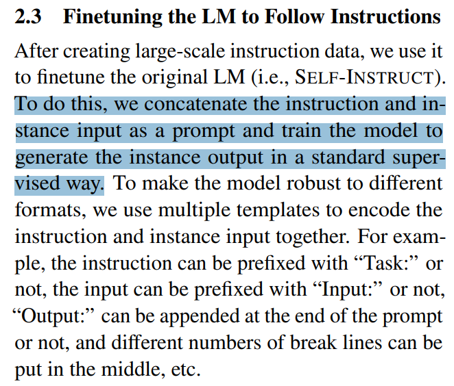
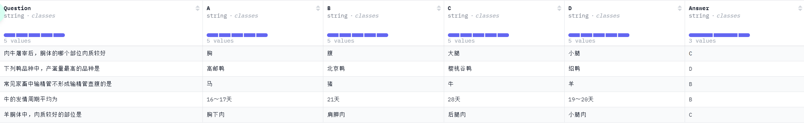

## Pre-Training

- `BookCorpus`: 包含互联网上收集的约 11,000 本未出版书籍的文本。用于训练OpenAI的GPT初始版本的主要语料库[1]，并用作包括谷歌的BERT[2]在内的，其他早期大型语言模型的训练数据。
- `RedPajama-V2`: 一个用于训练大型语言模型的开放数据集，包含超过 1000 亿份文本文档。

- Math
  - `AMPS`: 用于预训练，包含从 Khan Academy 中提取的 100,000 多个问题和从手动设计的 Mathematica 脚本生成的约 500 万个问题。超过23GB


## Evaluation & Fine-Tuning

- **Law**

  - `CaseHOLD`: https://huggingface.co/datasets/casehold/casehold

    法律判决案例, 53k+

    Multiple choice QA

    Metric: macro F1 score

    评测方法：自动评测

    

  - `lexGLUE`: https://huggingface.co/datasets/coastalcph/lex_glue

    用于评估在法律任务中性能，基于七个现有的法律 NLP 数据集

    Metric: micro-F1 (µ-F1) and macro-F1 (m-F1)

    评测方法：自动评测
    
    

- **Coding**

  - `APPS`: https://github.com/hendrycks/apps

    编程问题, 10k

    Text Generation

    Metric: Test Case Average, Strict Accuracy

    评测方法：自动评测
    
    

- **Math**

  - `MATH`: https://github.com/hendrycks/math

    数学竞赛问题, 12,500个问题（7,500 个训练问题和 5,000 个测试问题）

    Text Generation

    Metric: Accuracy

    评测方法：自动评测

    
    
    


- **Instruction**

  - `Self-Instruct`: https://github.com/yizhongw/self-instruct/

    - `data/gpt3-generations/batch_221203/all_instances_82K.jsonl`: a dataset that contains 52k instructions, paired with 82K instance inputs and outputs.

      

    - `data/seed_tasks.jsonl`: 175 seed tasks

      

    

  - `Stanford Alpaca`: https://github.com/tatsu-lab/stanford_alpaca/

    `alpaca_data.json` 用于微调 Alpaca 模型的52k instruction-following data

    

    

  - `InstructionWild`: https://github.com/XueFuzhao/InstructionWild/
    - `data`: 从 Twitter 中抓取、过滤掉noisy instructions，最后挑选出 429 条instructions。中文/英文版本
      - `seed_prompts_ch.jsonl`
      - `seed_prompts_en.jsonl`
      - 用类似Alpaca的方式生成了更大的52k数据

    - `data_v2`: 没有使用 self-instruct 生成，在网上收集的基于用户的 110k instructions
      - `user_1.jsonl`: 来自 Twitter 的 429 条 instructions，提供了更多样化的标签，例如 indication_type 和 special_tagand special_tag
      - `user_2.jsonl`: 248 instructions from Cookup.AI
      - `user_3.jsonl`:  201 instructions from GitHub
      - `user_4.jsonl`: 110031 instructions from Discord

- **Social**

  - `SOCKET`: https://github.com/minjechoi/SOCKET

    包含来自 35 个数据集的 58 个任务。58个任务按主题分为5个社会知识类别：`Humor & Sarcasm`, `Offensiveness`, `Sentiment & Emotion`, `Social Factors`, `Trustworthiness`。

    评测方法：自动评测

    
    
    

- **Emotion**

  - `emotion/EmotionBench-main/situations/situations.csv`: https://github.com/CUHK-ARISE/EmotionBench

    纯Evaluation数据集；8种情感共36种因素，428条情境

    | Anger-0                        | Anger-1                             | ⋯    | Anxiety-0          | Anxiety-1               | ⋯    |
    | ------------------------------ | ----------------------------------- | ---- | ------------------ | ----------------------- | ---- |
    | *Facing Self-Opinioned People* | *Blaming, Slandering, and Tattling* | ⋯    | *External Factors* | *Self-Imposed Pressure* | ⋯    |
    | When you ...                   | When your ...                       | ⋯    | You are ...        | You have ...            | ⋯    |
    | ⋮                              | ⋮                                   | ⋱    | ⋮                  | ⋮                       | ⋱    |

    

    PANAS

    

    

- **Safety**

  - `SafetyBench`: https://github.com/thu-coai/SafetyBench

    评估大模型安全性，有中英文版本，11435道题目，涵盖7种安全类别

    Multiple Choice Questions

    Metric: Accuracy

    评测方法：自动评测

    

    
    
    

- **Chinese**

  - `CEval`: https://github.com/hkust-nlp/ceval/

    综合的中文基础模型评估，包含 13948 道多项选择题，涵盖 52 个不同学科和四个难度级别

    Metric: Accuracy

    评测方法：自动评测

    

  - `CMMLU`: https://github.com/haonan-li/CMMLU/

    用于评估语言模型在中文语境下的知识和推理能力，涵盖了从基础学科到高级专业水平的67个主题。

    Metric: Accuracy

    评测方法：自动评测

    

  - `GAOKAO`: https://github.com/OpenLMLab/GAOKAO-Bench

    收集了2010-2022年全国高考卷的题目，其中包括1781道客观题和1030道主观题，测评大模型语言理解能力、逻辑推理能力
  
    Metric: 分数（客观题分数* 客观题得分率 + 主观题分数*主观题得分率，主观题由真人老师评分）
  
    评测方法：自动评测+人工评测
    
    


  - `CMB`: https://github.com/FreedomIntelligence/CMB

    - `CMB-Exam`: 全方位多层次测评模型医疗知识；6大项28小项；280,839道题目

      Metric: Accuracy

      评测方法：自动评测
    
      ```json
      {
          "exam_type": "医师考试",
          "exam_class": "执业医师",
          "exam_subject": "口腔执业医师",
          "question": "患者，男性，11岁。近2个月来时有低热（37～38℃），全身无明显症状。查体无明显阳性体征。X线检查发现右肺中部有一直径约0.8cm类圆形病灶，边缘稍模糊，肺门淋巴结肿大。此男孩可能患",
          "answer": "D",
          "question_type": "单项选择题",
          "option": {
              "A": "小叶型肺炎",
              "B": "浸润性肺结核",
              "C": "继发性肺结核",
              "D": "原发性肺结核",
              "E": "粟粒型肺结核"
          }
      },
      ```
    
      - exam_type: 大项分类;
      - exam_class: 小项分类;
      - exam_subject: 具体科室或细分学科分类;
      - question_type: 只有"单项选择题"和"多项选择题";

    - `CMB-Clin`: 测评复杂临床问诊能力，74例复杂病例问诊

      Metric: 三位具有专业医学知识的注释者人工评估，从流畅度、相关性、完整性和医学熟练度四个方面评分；利用 GPT-4评估，遵循与专家评估相同的指导原则
    
      评测方法：人工评测
      
      ```json
      {
          "id": "0",
          "title": "案例分析-腹外疝",
          "description": "现病史\n（1）病史摘要\n     病人，男，49岁，3小时前解大便后出现右下腹疼痛，右下腹可触及一包块，既往体健。\n（2）主诉\n     右下腹痛并自扪及包块3小时。\n\n体格检查\n体温： T 37.8℃，P 101次／分，呼吸22次/分，BP 100/60mmHg，腹软，未见胃肠型蠕动波，肝脾肋下未及，于右侧腹股沟区可扪及一圆形肿块，约4cm×4cm大小，有压痛、界欠清，且肿块位于腹股沟韧带上内方。\n\n辅助检查\n（1）实验室检查\n     血常规：WBC 5.0×109／L，N 78％。\n     尿常规正常。\n（2）多普勒超声检查\n     沿腹股沟纵切可见一多层分布的混合回声区，宽窄不等，远端膨大，边界整齐，长约4～5cm。\n（3）腹部X线检查\n     可见阶梯状液气平。",
          "QA_pairs": [
              {
                  "question": "简述该病人的诊断及诊断依据。",
                  "answer": "诊断：嵌顿性腹股沟斜疝合并肠梗阻。\n      诊断依据：\n      ①右下腹痛并自扪及包块3小时；\n      ②有腹胀、呕吐，类似肠梗阻表现；腹部平片可见阶梯状液平，考虑肠梗阻可能；腹部B超考虑， \n腹部包块内可能为肠管可能；\n      ③有轻度毒性反应或是中毒反应，如 T 37.8℃，P 101次／分，白细胞中性分类78％；\n      ④腹股沟区包块位于腹股沟韧带上内方。"
              },
              {
                  "question": "简述该病人的鉴别诊断。",
                  "answer": "（1）睾丸鞘膜积液：鞘膜积液所呈现的肿块完全局限在阴囊内，其上界可以清楚地摸到；用透光试验检查肿块，鞘膜积液多为透光（阳性），而疝块则不能透光。\n     （2）交通性鞘膜积液：肿块的外形与睾丸鞘膜积液相似。于每日起床后或站立活动时肿块缓慢地出现并增大。平卧或睡觉后肿块逐渐缩小，挤压肿块，其体积也可逐渐缩小。透光试验为阳性。\n     （3）精索鞘膜积液：肿块较小，在腹股沟管内，牵拉同侧睾丸可见肿块移动。\n     （4）隐睾：腹股沟管内下降不全的睾丸可被误诊为斜疝或精索鞘膜积液。隐睾肿块较小，挤压时可出现特有的胀痛感觉。如患侧阴囊内睾丸缺如，则诊断更为明确。\n     （5）急性肠梗阻：肠管被嵌顿的疝可伴发急性肠梗阻，但不应仅满足于肠梗阻的诊断而忽略疝的存在；尤其是病人比较肥胖或疝块较小时，更易发生这类问题而导致治疗上的错误。\n     （6）此外，腹股沟区肿块还应与以下疾病鉴别:肿大的淋巴结、动（静）脉瘤、软组织肿瘤、脓肿、\n圆韧带囊肿、子宫内膜异位症等。"
              },
              {
                  "question": "简述该病人的治疗原则。",
                  "answer": "嵌顿性疝原则上需要紧急手术治疗，以防止疝内容物坏死并解除伴发的肠梗阻。术前应做好必要的准备，如有脱水和电解质紊乱，应迅速补液加以纠正。手术的关键在于正确判断疝内容物的活力，然后根据病情确定处理方法。在扩张或切开疝环、解除疝环压迫的前提下，凡肠管呈紫黑色，失去光泽和弹性，刺激后无蠕动和相应肠系膜内无动脉搏动者，即可判定为肠坏死。如肠管尚未坏死，则可将其送回腹腔，按一般易复性疝处理，即行疝囊高位结扎+疝修补术。如肠管确已坏死或一时不能肯定肠管是否已失去活力时，则应在病人全身情况允许的前提下，切除该段肠管并进行一期吻合。凡施行肠切除吻合术的病人，因手术区污染，在高位结扎疝囊后，一般不宜作疝修补术，以免因感染而致修补失败。"
              }
          ]
      }
      ```
      
      - title: 病例疾病名称;
      - description: 病例信息;
      - QA_pairs: 一系列诊断问题和对应标准回答;
    
    


- bioasq-biobert-1.0: 生物医学问答

  BioASQ 6b/7b - Phase B 数据集的预处理版本，下载链接在`README.md`

  

- casehold: https://github.com/reglab/casehold

- data

- dolly

  Dolly 接受了约 15k instruction/response fine tuning records `databricks-dolly-15k`的训练，这些记录由 Databricks 员工在 InstructGPT 论文中的能力领域生成，包括including brainstorming, classification, closed QA, generation, information extraction, open QA and summarization. 

  - `databricks-dolly-15k`: https://huggingface.co/datasets/databricks/databricks-dolly-15k

    ```python
    from datasets import load_dataset
    
    ds = load_dataset("databricks/databricks-dolly-15k")
    ```

    | instruction | context | response | category |
    | ----------- | ------- | -------- | -------- |
    |             |         |          |          |

- FLAN-main

  mixture

  "flan" (Flan 2021), "t0" (P3 excluding Flan 2021), "niv2" (Super-Natural Instructions) "cot" (several Chain-of-Thought datasets), and "dialog" (a few new dialog datasets)

- Open-Assistant-main

  - `oasst2`: https://huggingface.co/datasets/OpenAssistant/oasst2

    包含消息树。每棵消息树都有一个初始提示消息作为根节点，该消息可以有多条子消息作为回复，而这些子消息又可以有多条回复。

    所有消息都具有角色属性：可以是“助手”或“提示者”。从提示者到叶节点，对话线程中的角色严格在“提示者”和“助手”之间交替。

  - `data`

- open-instruct-main

  - HuggingFace 上 处理过的Tulu v1和Tulu v2 SFT 数据集，链接在`README.md`

    Tulu v2:

    - [FLAN](https://github.com/google-research/FLAN/tree/main) (Apache 2.0): We use 50,000 examples sampled from FLAN v2. To emphasize CoT-style reasoning, we sample another 50,000 examples from the CoT subset of the FLAN v2 mixture.
    - [Open Assistant 1](https://huggingface.co/datasets/OpenAssistant/oasst1) (Apache 2.0): We isolate the highest-scoring paths in each conversation tree and use these samples, resulting in 7,708 examples.
    - [ShareGPT](https://huggingface.co/datasets/anon8231489123/ShareGPT_Vicuna_unfiltered) (Apache 2.0 listed, no official repo found): We use all 114,046 from our processed ShareGPT dataset, as we found ShareGPT gave strong performance in prior work.
    - [GPT4-Alpaca](https://github.com/Instruction-Tuning-with-GPT-4/GPT-4-LLM#data-release) (CC By NC 4.0):We sample 20,000 samples from GPT-4 Alpaca to further include distilled GPT-4 data.
    - [Code-Alpaca](https://github.com/sahil280114/codealpaca) (CC By NC 4.0):We use all 20,022 examples from Code Alpaca, following our prior V1 mixture, in order to improve model code abilities.
    - [LIMA](https://huggingface.co/datasets/GAIR/lima) (CC BY-NC-SA): We use 1,030 examples from LIMA as an example of carefully curated data.
    - [WizardLM Evol Instruct](https://huggingface.co/datasets/WizardLM/WizardLM_evol_instruct_V2_196k) (No license provided): We subsample 30,000 examples from WizardLM, which contains distilled data of increasing diversity and complexity.
    - [Open-Orca](https://huggingface.co/datasets/Open-Orca/OpenOrca) (MIT): We sample 30,000 samples generated by GPT-4 from OpenOrca, a reproduction of Orca Mukherjee et al., 2023, which augments FLAN data with additional model-generated explanations
    - Hardcoded: A collection of prompts such as `Tell me about yourself' such that the model generates correct outputs given inquiries about its name or developers. We wrote 14 samples and repeat each sample 10 times in the mixture, resulting in 140 total samples.
    - Science: 7,544 examples from a mixture of scientific document understand tasks—including question answering, fact-checking, summarization, and information extraction (under development, standalone release soon).

- sharegpt-main

  https://huggingface.co/datasets/anon8231489123/ShareGPT_Vicuna_unfiltered

----------------

- choice-75 (scrip learning)

  - Format:
    - Script
      - `goal` (str): goal of the script
      - `steps` (list[str]): list of steps
      - `original_index` (int): original index in ProScript
      - `index` (int): randomized index
      - `branching_info` (dict): information about branching
        - `branching_idx` (int): index of the branching step
        - `branching_step` (str): content of the branching step
        - `option 1`, `option 2` (str): options for the branching
        - `op1_ra`, `op2_ra` (list[int]): list of rationales for the branches
        - `typr` (str): type of this branching, could be `golden`, `silver_dev`
        - `dataset`: dataset, could be `train`, `dev`, `test`

- legal

  - `cuad`: 包含 510 份商业法律合同中 13,000 多个标签的语料库。这些标签由经验丰富的律师监督下手动标记，以识别 41 种在与公司交易（包括并购等）相关的合同审查中被认为重要的法律条款。 

    包括 1 个 CSV 文件(1 master clauses CSV)、1 个 SQuAD 样式 JSON 文件、28 个 Excel 文件、510 个 PDF 文件和 510 个 TXT 文件

- tools

  - `api-bank`: 包含来自 2,138 个 API 的 1,888 个工具使用对话，涵盖 1,000 个不同的领域

    https://huggingface.co/datasets/liminghao1630/API-Bank

  - `ToolBench`: 从RapidAPI抓取了 16000 多个真实 API ，并整理出涉及这些 API 的真实人工指令

    下载地址在`README.md`